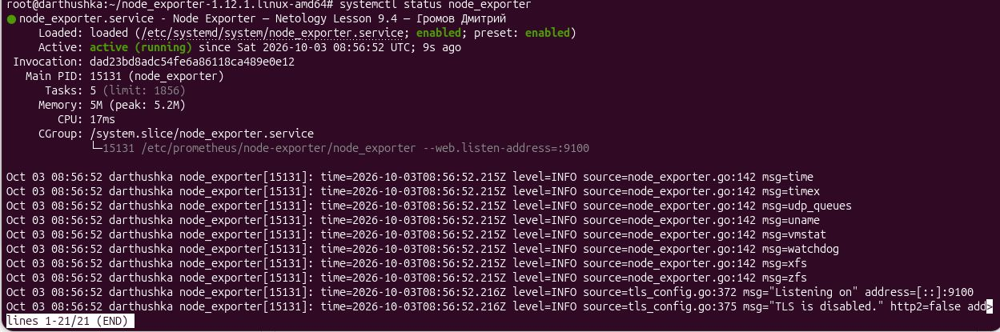
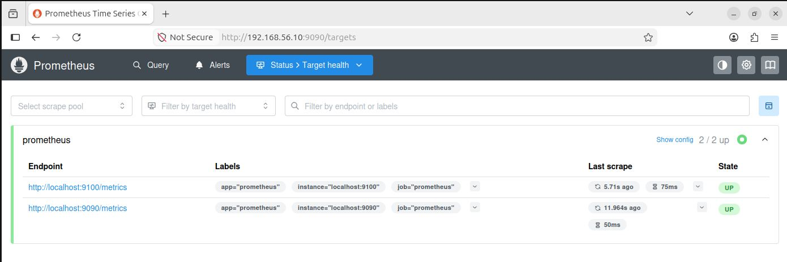
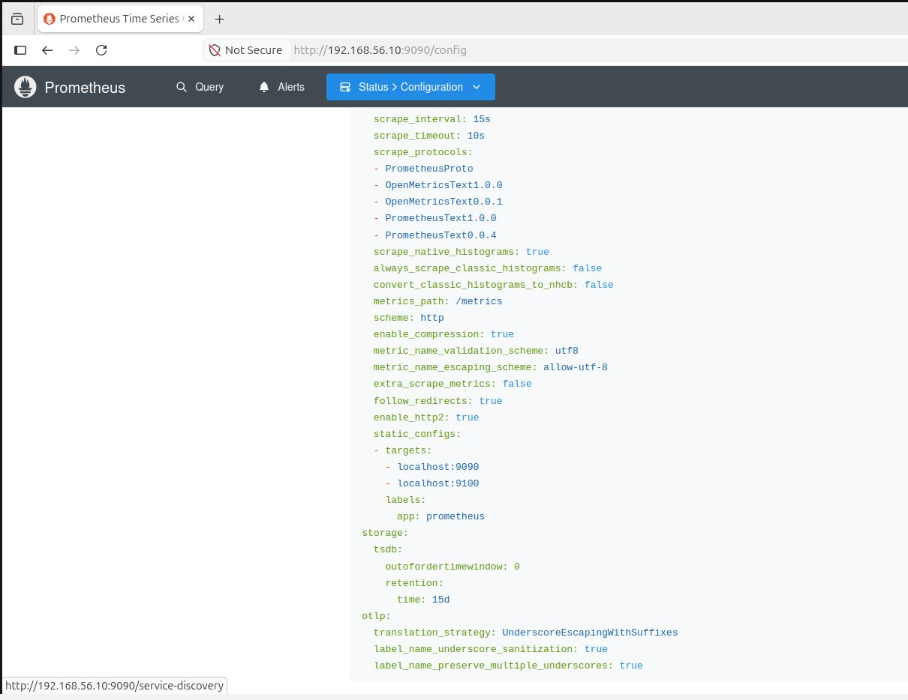
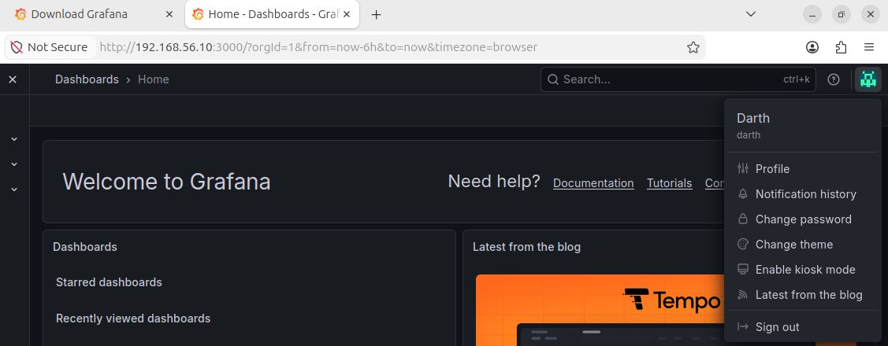

# Домашнее задание к занятию "`Система мониторинга Prometheus часть 1`" - `Громов Дмитрий`


### Инструкция по выполнению домашнего задания

   1. Сделайте `fork` данного репозитория к себе в Github и переименуйте его по названию или номеру занятия, например, https://github.com/имя-вашего-репозитория/git-hw или  https://github.com/имя-вашего-репозитория/7-1-ansible-hw).
   2. Выполните клонирование данного репозитория к себе на ПК с помощью команды `git clone`.
   3. Выполните домашнее задание и заполните у себя локально этот файл README.md:
      - впишите вверху название занятия и вашу фамилию и имя
      - в каждом задании добавьте решение в требуемом виде (текст/код/скриншоты/ссылка)
      - для корректного добавления скриншотов воспользуйтесь [инструкцией "Как вставить скриншот в шаблон с решением](https://github.com/netology-code/sys-pattern-homework/blob/main/screen-instruction.md)
      - при оформлении используйте возможности языка разметки md (коротко об этом можно посмотреть в [инструкции  по MarkDown](https://github.com/netology-code/sys-pattern-homework/blob/main/md-instruction.md))
   4. После завершения работы над домашним заданием сделайте коммит (`git commit -m "comment"`) и отправьте его на Github (`git push origin`);
   5. В личном кабинете прикрепите и отправьте ссылку на решение в виде md-файла в вашем Github.
   6. Любые вопросы по выполнению заданий спрашивайте в разделе “Вопросы по заданию” в личном кабинете.
   
Желаем успехов в выполнении домашнего задания!
   
### Дополнительные материалы, которые могут быть полезны для выполнения задания

1. [Руководство по оформлению Markdown файлов](https://gist.github.com/Jekins/2bf2d0638163f1294637#Code)

---

### Задание 1

`Приведите ответ в свободной форме........`

1. `Заполните здесь этапы выполнения, если требуется ....`
2. `Заполните здесь этапы выполнения, если требуется ....`
3. `Заполните здесь этапы выполнения, если требуется ....`
4. `Заполните здесь этапы выполнения, если требуется ....`
5. `Заполните здесь этапы выполнения, если требуется ....`
6. 

```
Поле для вставки кода...
useradd --no-create-home --shell /bin/false prometheus
wget https://github.com/prometheus/prometheus/releases/download/v3.15.0/prometheus-3.15.0.linux-amd64.tar.gz
tar xvfz prometheus-3.15.0.linux-amd64.tar.gz
cd prometheus-3.15.0.linux-amd64
mkdir /etc/prometheus
mkdir /var/lib/prometheus
cp ./prometheus promtool /usr/local/bin
cp ./prometheus.yml /etc/prometheus
chown -R prometheus:prometheus /etc/prometheus/ /var/lib/prometheus/
chown prometheus:prometheus /usr/local/bin/prometheus
chown prometheus:prometheus /usr/local/bin/promtool
nano /etc/systemd/system/prometheus.service
systemctl enable prometheus.service
systemctl start prometheus.service 
systemctl status prometheus.service
....
....
```

При необходимости прикрепитe сюда скриншоты


---

### Задание 2

`Приведите ответ в свободной форме........`

1. `Заполните здесь этапы выполнения, если требуется ....`
2. `Заполните здесь этапы выполнения, если требуется ....`
3. `Заполните здесь этапы выполнения, если требуется ....`
4. `Заполните здесь этапы выполнения, если требуется ....`
5. `Заполните здесь этапы выполнения, если требуется ....`
6. 

```
Поле для вставки кода...
wget https://github.com/prometheus/node_exporter/releases/download/v1.12.1/node_exporter-1.12.1.linux-amd64.tar.gz
tar xvfz node_exporter-1.12.1.linux-amd64.tar.gz
cd node_exporter-1.12.1.linux-amd64/
mkdir /etc/prometheus/node-exporter
cp ./node_exporter /etc/prometheus/node-exporter/
chown prometheus:prometheus /etc/prometheus/node-exporter/
chown prometheus:prometheus /etc/prometheus/node-exporter/node_exporter
nano /etc/systemd/system/node_exporter.service
systemctl enable node_exporter
systemctl start node_exporter
systemctl status node_exporter
....
....
....
....
```

При необходимости прикрепитe сюда скриншоты



---

### Задание 3

`Приведите ответ в свободной форме........`

1. `Заполните здесь этапы выполнения, если требуется ....`
2. `Заполните здесь этапы выполнения, если требуется ....`
3. `Заполните здесь этапы выполнения, если требуется ....`
4. `Заполните здесь этапы выполнения, если требуется ....`
5. `Заполните здесь этапы выполнения, если требуется ....`
6. 

```
Поле для вставки кода...
nano /etc/prometheus/prometheus.yml
systemctl restart prometheus.service
systemctl status prometheus.service
....
....
....
....
```

При необходимости прикрепитe сюда скриншоты



### Задание 4

`Приведите ответ в свободной форме........`

1. `Заполните здесь этапы выполнения, если требуется ....`
2. `Заполните здесь этапы выполнения, если требуется ....`
3. `Заполните здесь этапы выполнения, если требуется ....`
4. `Заполните здесь этапы выполнения, если требуется ....`
5. `Заполните здесь этапы выполнения, если требуется ....`
6. 

```
Поле для вставки кода...
sudo apt-get install -y adduser libfontconfig1 musl
wget https://mirror.yandex.ru/mirrors/packages.grafana.com/oss/deb/pool/main/g/grafana/grafana_12.4.2_23531306697_linux_amd64.deb
dpkg -i grafana_12.4.2_23531306697_linux_amd64.deb
systemctl eneble grafana-server
systemctl start grafana-server
systemctl status grafana-server

....
....
....
....
```

При необходимости прикрепитe сюда скриншоты

